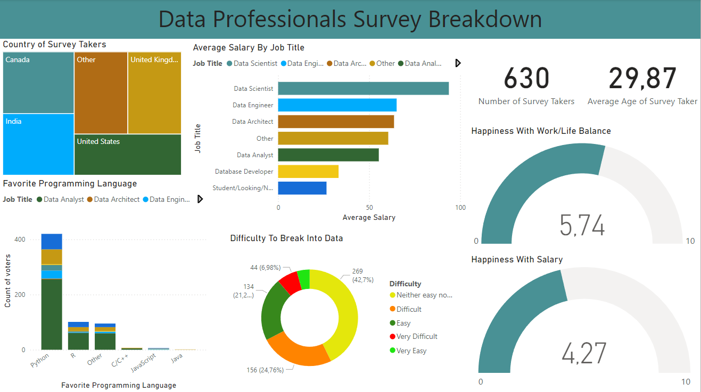

# Power BI Data Professionals Survey Project
In this project we analyse the survey answers of data professionals, to discover key insights about the field of data analytics. 

## Tools and technologies
- **Power BI**: Data cleaning, data exploration and creation of final dashboard

## Project Objectives
- Identify patterns amongst data professionals
- Discover key insights about the field of data analytics

## Data Sources
- [Data Professionals Survey Dataset](data_professionals_survey_dataset.xlsx)

## Analysis steps
- **Data Cleaning in Power Query Editor**:
  - Removed irrelevant columns
  - Consolidated all "Other" responses into a single category
  - Made an average yearly salary
- **Data Exploration**:
  - Made a card with the number of survey takers
  - Made a card with the average age of survey takers
  - Made a stacked bar chart based on the survey takers title and average salary
  - Made a stacked column chart based on the survey takers favorite programming language and number of survey takers 
  - Made a treemap based on the survey takers country
  - Made a gauge showing the survey takers average happiness with their work/life balance
  - Made a gauge showing the survey takers average happiness with their salary
  - Made a donut chart based on how difficult it was for survey takers to break into data
  - Combined visuals into a dashboard
  - Updated the theme and colors to make the dashboard more visually appealing

## Key findings
- The average data professional is not happy with their salary and work/life balance
- Data scientists make significantly more than other data positions
- Python is by far the most favored programming language

## Visualizations
**Data Professionals Survey Breakdown**

## Conclusion
Data professionals believe they work too much with too little pay. 
Data scientist is a position worth striving for and python is an intuitive programming language that most data professionals enjoy using. 
